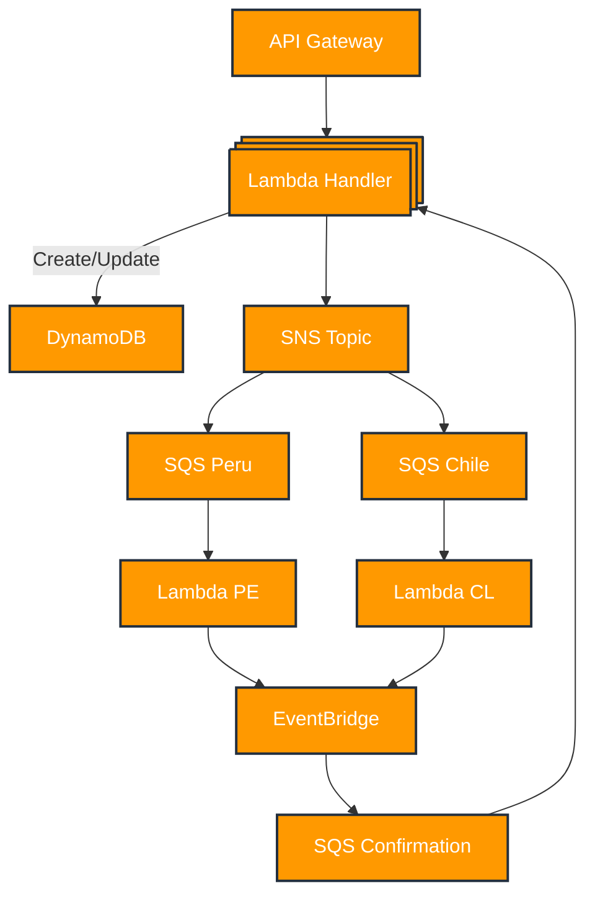

# Appointment Management Service

A serverless REST API for managing medical appointments across different countries.

## Architecture

The system uses an event-driven architecture with the following AWS services:

- **API Gateway**: Routes HTTP requests to Lambda functions
- **Lambda**: Processes requests and handles business logic
- **DynamoDB**: Stores appointment data
- **SNS**: Routes appointments to country-specific queues
- **SQS**: Manages country-specific appointment processing
- **EventBridge**: Handles appointment confirmation events

### Flow Diagram



## Endpoints

## Base URL
`https://pm5b4jzwi8.execute-api.us-east-1.amazonaws.com`

### POST /V1/appointment
Creates a new appointment
- **Request**: AppointmentRequest object
- **Response**: Success/Error response

### GET /V1/appointment/{appointmentId}
Retrieves an appointment by ID
- **Request**: Path parameter `appointmentId`
- **Response**: Success/Error response

### GET /V1/appointments/{insuredId}
Retrieves all appointments for an insured
- **Request**: Path parameter `insuredId`
- **Response**: Success/Error response

## SOLID Principles Implementation

1. **Single Responsibility**
    - Each Lambda function has one purpose
    - Separate handlers for PE/CL processing

2. **Open/Closed**
    - Country-specific logic isolated in separate handlers
    - New countries can be added without modifying existing code

3. **Liskov Substitution**
    - Common interfaces for appointment processing
    - Country handlers are interchangeable

4. **Interface Segregation**
    - Specific event patterns for each queue
    - Separated confirmation handling

5. **Dependency Inversion**
    - Business logic depends on abstractions
    - Infrastructure details isolated in adapters

## Serverless Resources

### Storage
- `AppointmentsTable`: DynamoDB table for appointment storage

### Messaging
- `ApointmentSnsTopic`: Routes appointments by country
- `SQSPE`/`SQSCL`: Country-specific processing queues
- `SQSConfirmation`: Handles appointment confirmations

### Event Management
- `CompletedAppointmentsEventBus`: Manages completion events
- `AppointmentEventRule`: Routes events to confirmation queue

### Security
- `SnsToSqsPolicy`: Allows SNS to SQS message flow
- `EventBridgeToConfirmatedQueuePolicy`: Allows EventBridge to SQS flow

## Setup & Configuration

1. Install dependencies:
```bash
npm install
```

2. Local development:
```bash
sls offline
```

3. Deploy:
```bash
npm run deploy
```

## Environment Variables

Required environment variables:
- `DYNAMODB_TABLE`
- `SNS_TOPIC_ARN`
- `SQS_PE_ARN`
- `SQS_CL_ARN`
